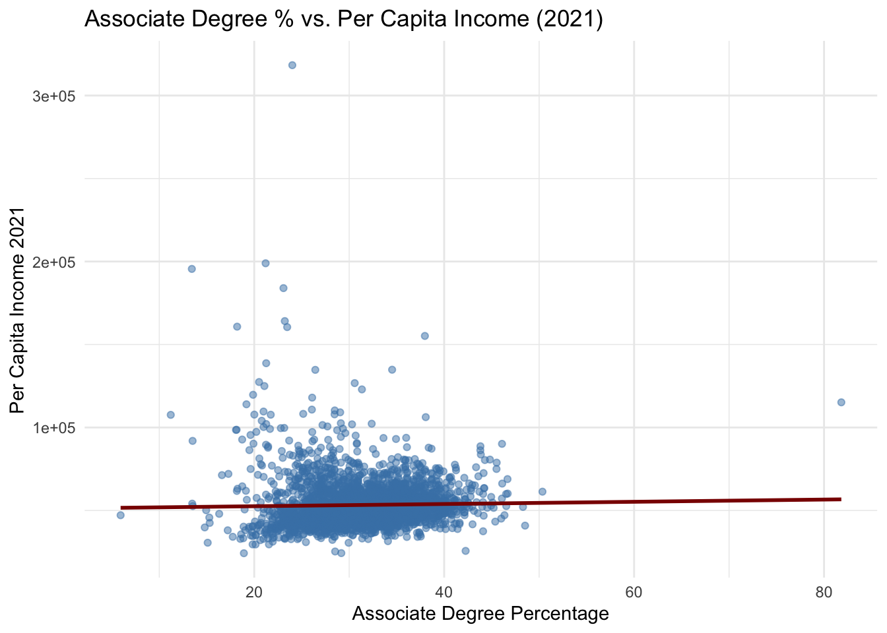

# Education and Income
## By Nick M, Jackson T, Harrison P
This contains a summary of the Final Project for DS 201. For more in-depth in-sight, please check out our walkthrough video or run our notebook directly in Google Colab linked below.
## Introduction

As data science students, we often look to data as a tool to illuminate persistent inequalities and uncover meaningful patterns that shape our society. In the United States, the connection between education and economic prosperity is frequently assumed to be direct and causal. Higher levels of education are believed to lead to higher incomes, better employment opportunities, and improved quality of life. But is this relationship as straightforward as it seems?

The U.S. education system is vast and varied, with counties across the country showing significant differences in degree attainment. According to the U.S. Census Bureau, educational attainment is one of the strongest predictors of economic mobility, but disparities in access to quality education remain a pressing issue. Rural counties, in particular, often face systemic barriers to both higher education and high-paying jobs. Understanding how education levels correlate with income at the county level is essential to evaluating the effectiveness of education policy and identifying communities that may be underserved.

At the same time, it is important to recognize that income is shaped by more than just education. Local industries, cost of living, historical inequality, and regional infrastructure also play key roles. While one county may see high earnings with modest degree attainment due to a dominant industry, another may struggle economically despite high educational levels. This complexity raises an important question: How strongly does educational attainment, specifically the percentage of residents with associate or bachelor’s degrees,predict per capita income across U.S. counties?

To explore this, we analyzed a dataset that includes income data from 2019 to 2021 and education statistics spanning from 2015 to 2020. By comparing these variables across hundreds of U.S. counties, we aim to assess whether patterns exist that can help explain economic outcomes through the lens of higher education. While this study is limited to quantitative correlations, it can serve as a starting point for understanding how educational investment might influence local economies and where such investment may have the greatest impact.

Ultimately, **our goal is to test whether increasing educational attainment aligns with increased personal income** and to consider what this relationship implies for regional policy, resource allocation, and long-term economic development in the United States.

## Data Organization
Our dataset merges county-level income and education statistics from two primary sources: the Bureau of Economic Analysis (BEA) and the U.S. Department of Agriculture (USDA). It includes over 3,000 U.S. counties and focuses on recent data spanning 2015 to 2021.

The income data, sourced from the BEA (November 2022 release), includes:

- per_capita_personal_income_2019
- per_capita_personal_income_2020
- per_capita_personal_income_2021

These figures represent average income per person in each county, incorporating wages, investment returns, and government transfers.

The education data, from the USDA County-Level Dataset, includes both counts and percentages:

- associate_degree_numbers_2016_2020
- bachelor_degree_numbers_2016_2020
- associate_degree_percentage_2016_2020
- bachelor_degree_percentage_2015_2019

This dataset provides both the total number and the percentage of county residents who earned associate and bachelor’s degrees over specified time periods.

We also retained identifying information:

- county_FIPS, state, county

These columns identify the geographic location of each observation using the county’s FIPS code, state name, and county name.

These variables enable analysis of both absolute and relative educational attainment, allowing us to explore how income levels relate to education across different counties and regions. The multi-year averages smooth out short-term fluctuations and improve reliability. This structured dataset sets the foundation for statistical and spatial analysis of the link between economic prosperity and access to higher education.

We started by reading the data from a CSV file hosted on GitHub and used the janitor package to clean and standardize column names. This is important to ensure consistent formatting for downstream analysis and modeling. We then created a variable summary table to document each feature’s type (nominal, ratio) and a short description. This helps in understanding the dataset schema and planning which variables are suitable for modeling and visualization.

#### Variable Summary Table

## Exploratory Data Analysis
Research Question: How does education affect income at the county level in the United States?

To begin exploring the relationship between education and income, we conducted a thorough Exploratory Data Analysis (EDA) using a dataset containing U.S. county-level data on per capita personal income from 2019 to 2021, along with educational attainment rates for associate’s and bachelor’s degrees.

⸻

3. Summary Statistics

Using the summary() function, we obtained descriptive statistics (mean, median, min, max, etc.) for all numerical variables.
	•	Purpose: This provides a general sense of distribution, central tendency, and variation in the data.

📌 Insert: Summary statistics output

To better understand the structure of our dataset, we reviewed the variable types and key summary statistics across all 3,006 U.S. counties.

**Dataset Overview**
The dataset includes 10 columns: 3 nominal identifiers (county FIPS, state, county name) and 7 ratio-scale variables covering income and education metrics.

**Income Distribution**

Per capita personal income increased steadily from a mean of $45,947 in 2019 to $53,308 in 2021.

Income is right-skewed with a 2021 maximum of $318,297, indicating a few high-income counties disproportionately pulling up the average.

**Education Statistics**

Associate degree percentages range from a minimum of ~0% to a maximum over 80%, with a median around ~30%.

Bachelor’s degree percentages show an even wider spread, ranging up to nearly 76% in some counties, with a median around 33%.

Raw degree counts vary massively—some counties have just a few hundred degree holders, while the largest counties exceed 1–2 million.

These distributions reaffirm our earlier visual findings: education levels and income vary drastically across counties, setting the stage to analyze how tightly they are connected.

⸻

4. Missing Values Check

We checked for missing values across all columns using colSums(is.na(data)).
	•	Purpose: Identifying and handling missing data is crucial to avoid bias or errors in modeling.

📌 Insert: Output showing missing value counts per column

⸻

5. Income Growth Over Time

We visualized how per capita income changed across 2019, 2020, and 2021 using boxplots.
	•	Purpose: To observe income distribution and trends over time, and to check for major economic shifts (e.g., pandemic impact).
	•	Insight: This helps contextualize education’s effect on income by tracking whether changes in income are consistent over time.

This boxplot illustrates the distribution of per capita income across U.S. counties from 2019 to 2021. Across all three years, the distribution is right-skewed, with a small number of counties reporting very high incomes. While the overall shape remains consistent, there is a gradual increase in both the median and upper quartile values each year, indicating modest national income growth. These results establish a baseline for our analysis, helping us explore whether rising income levels are consistently linked to higher education attainment across counties.

⸻

6. Education Level Distributions

We plotted boxplots of associate and bachelor’s degree percentages.
	•	Purpose: To understand how educational attainment is distributed across counties, which is foundational for correlating with income.

Associate degree attainment is generally higher and more consistent across counties, likely due to broader access through community colleges. In contrast, bachelor’s degree attainment shows much wider variation—some counties have very low rates while others report extremely high percentages, reflecting structural disparities in access to four-year institutions.

This contrast raises a key question: **which level of education—associate or bachelor’s—is more closely linked to income?** If associate degrees correlate strongly with income, they may offer a more accessible path to economic growth. If bachelor’s degrees show a stronger link, efforts to expand four-year degree access could have greater impact. To investigate, we next compare each degree type directly with income levels.

⸻

7. Education vs. Income (Scatter Plots)

We created two scatter plots showing the relationship between:
	•	Associate Degree % and Income (2021)
	•	Bachelor’s Degree % and Income (2021)

Each included a linear regression trend line.
	•	Purpose: To visually assess the strength and direction of correlation between education level and income.
	•	Insight: A clear positive trend would suggest that higher education rates are associated with higher per capita income.

This scatterplot explores the relationship between associate degree attainment and per capita income in 2021. The data show that while most counties have associate degree rates between 20% and 40%, income levels vary widely, with no clear upward trend. The flat regression line reinforces this observation—higher associate degree percentages do not consistently align with higher incomes. Though a few counties report exceptionally high income, they do not correspond to the highest associate degree rates, suggesting these outliers are influenced by other factors like local industry or advanced degrees.

This weak correlation raises questions about the economic value of associate degrees at the county level. While associate degrees are more accessible and widely distributed, they may not deliver the same income boost as bachelor’s degrees. These results suggest that associate-level education alone may not be a strong driver of income growth and underscore the need to examine how different levels of educational attainment contribute to economic outcomes.

This scatterplot shows the relationship between bachelor’s degree attainment and per capita income across U.S. counties in 2021. Compared to the previous chart on associate degrees, this graph reveals a much clearer positive correlation. As the percentage of residents with a bachelor’s degree increases, per capita income tends to rise as well. The upward-sloping regression line confirms this trend, suggesting that counties with higher levels of four-year college attainment generally experience higher income levels.

The spread of data is broader at higher education levels, reflecting greater variability in income among counties with more bachelor’s degree holders. Still, the clustering of points along the trend line indicates a stronger and more consistent link between bachelor’s degrees and economic prosperity. This pattern supports the hypothesis that bachelor’s-level education plays a more direct role in boosting income, and underscores the potential value of policies that increase access to four-year degree programs.

⸻

8. Correlation Matrix

We created a correlation matrix and heatmap for all numeric variables.
	•	Purpose: To quantitatively identify relationships between variables.
	•	Insight: This confirms whether our educational variables are significantly correlated with income, justifying their use in a predictive model.

📊 Insert: Correlation matrix heatmap

This scatterplot matrix provides a compact view of the relationships between per capita income (2021), associate degree percentage, and bachelor’s degree percentage. The correlation values and scatterplots align closely with our previous findings.

Most notably, there is a strong positive correlation (0.618) between bachelor’s degree attainment and income, suggesting that counties with a higher share of bachelor’s degree holders tend to have significantly higher per capita income. This supports our earlier observation that four-year degrees are a key driver of economic performance at the regional level.

In contrast, the correlation between associate degree percentage and income is nearly flat at 0.024, reinforcing that associate degree attainment alone does not meaningfully predict higher income outcomes across counties. This finding is consistent with the weak trendline we observed in the associate degree scatterplot.

An interesting secondary pattern is the slight negative correlation (-0.059) between associate and bachelor’s degree percentages. This may indicate that counties tend to emphasize one form of postsecondary education over the other—either favoring technical/community college pathways or four-year university pipelines, but rarely both at high levels.

Overall, this matrix helps confirm that while both degrees are common across the U.S., only bachelor’s degree attainment shows a strong and consistent relationship with income, providing clear direction for policy and investment strategies.
⸻

9. Linear Assumption & Distribution Checks

Using ggpairs, we evaluated distributions, outliers, and pairwise relationships between key variables.
	•	Purpose: To visually assess assumptions for linear modeling, including normality and linear relationships.
	•	Insight: Ensures that data meets the assumptions required for linear regression to be valid.

📊 Insert: GGPairs matrix showing histograms and scatter plots

⸻

10. Preprocessing for Modeling

Before training the model, we handled missing values via median imputation for numeric columns and dropped rows with missing categorical values. We also scaled numeric variables.
	•	Purpose: Preprocessing ensures that the model is trained on clean, normalized data, which improves accuracy and convergence.
	•	Insight: Proper preprocessing prevents data skew and enhances model interpretability.

📌 Insert: Note or table showing before/after stats for NA counts and feature scales

⸻

11. Feature Selection and Data Splitting

We selected per_capita_personal_income_2021 as the target variable and used the remaining features as predictors. We split the data into training and test sets (70/30).
	•	Purpose: Splitting ensures the model can be evaluated on unseen data, which is essential for estimating real-world performance.

📌 Insert: Table showing number of observations in train/test sets

⸻

12. Summary

Our EDA shows promising evidence of a positive relationship between education levels and income. These insights justify the development of a predictive model using education rates as key features.

⸻

## Main Observations and Conclusion
.

## Actionable Steps
probs figure out later

## Links
Youtube Video:
Google Colab:
